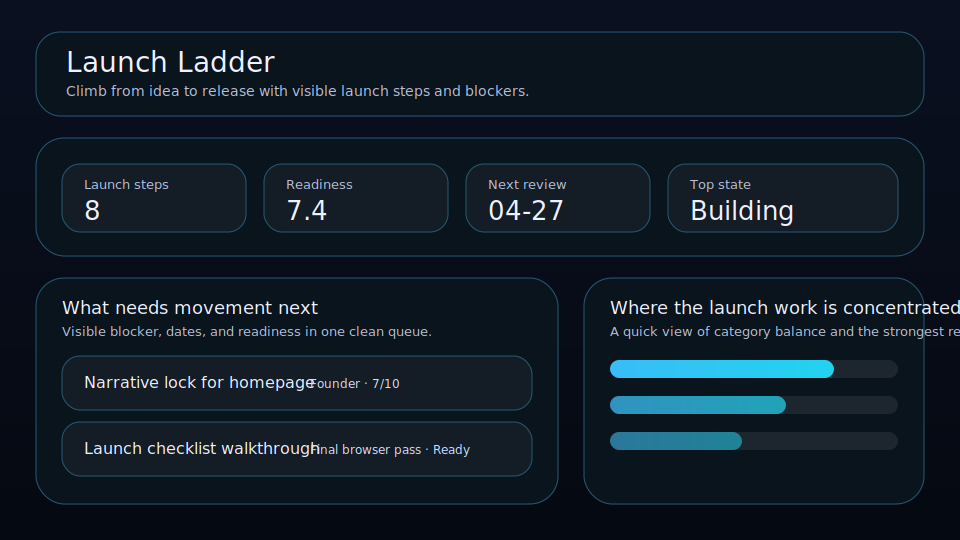

# Launch Ladder

Climb from idea to release with visible launch steps and blockers.



Launch Ladder is a local-first workspace for founders, operators, and solo builders who want a cleaner way to manage launch steps. It keeps readiness, owner, blocker, and review timing visible so the right things move forward with less drift.

## What it does

- ranks launch steps by leverage, readiness, timing, and friction
- tracks **owner**, **blocker**, **launch date**, and **readiness** for each launch step
- highlights the best current bet, the next review slot, and the strongest signal on the board
- renders a dedicated queue plus a category mix snapshot beneath the main board
- saves locally in the browser with JSON import/export backups
- quick action: **Schedule launch**
- quick action: **Clear blocker**
- quick action: **Mark released**

## Why it feels different

Launch Ladder is not just a generic list. It is shaped around the real workflow behind launch steps, so the board helps you decide what matters next instead of simply storing records.

## Quick start

```bash
git clone https://github.com/get2salam/launch-ladder.git
cd launch-ladder
python -m http.server 8000
```

Then open <http://localhost:8000>.

## Keyboard shortcuts

- `N` creates a new launch step
- `/` focuses the search box

## Privacy

Everything stays in your browser unless you export a JSON backup.

## License

MIT
