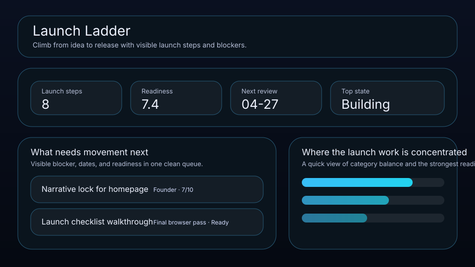

# Launch Ladder

Climb from idea to release with visible launch steps and blockers.



Launch Ladder is a local-first workspace for founders, operators, and solo builders who want a cleaner way to manage launch steps. It keeps readiness, owner, blocker, and review timing visible so the right things move forward with less drift.

## What it does

- ranks launch steps by leverage, readiness, timing, and friction
- tracks **owner**, **blocker**, **launch date**, and **readiness** for each launch step
- highlights the best current bet, the next review slot, and the strongest signal on the board
- renders a dedicated queue plus a category mix snapshot beneath the main board
- saves locally in the browser with JSON import/export backups
- quick action: **Schedule launch**
- quick action: **Clear blocker**
- quick action: **Mark released**

## Why it feels different

Launch Ladder is not just a generic list. It is shaped around the real workflow behind launch steps, so the board helps you decide what matters next instead of simply storing records.

## Quick start

```bash
git clone https://github.com/get2salam/launch-ladder.git
cd launch-ladder
python -m http.server 8000
```

Then open <http://localhost:8000>.

## Keyboard shortcuts

- `N` creates a new launch step
- `/` focuses the search box

## Generate a launch digest

The board exports each workspace as JSON. A small Node script reads a backup and prints a prioritized digest, so you can review the queue from the terminal or pipe it into another tool.

```bash
node scripts/launch-digest.mjs examples/sample-backup.json --asof 2026-04-25
```

The optional `--asof YYYY-MM-DD` flag pins "today" to a fixed date so the digest is deterministic in scripts and CI; omit it to use the current date. The digest excludes released steps from the active queue, applies the same priority formula the board uses, and surfaces the soonest launch and the strongest readiness signal.

The digest module is covered by a small `node:test` suite. Run it with:

```bash
npm test
```

For the same local checks that run in GitHub Actions, use:

```bash
npm run verify
```

`npm run verify` executes the test suite and a deterministic sample digest smoke check against `examples/sample-backup.json`.

## Privacy

Everything stays in your browser unless you export a JSON backup.

## License

MIT
